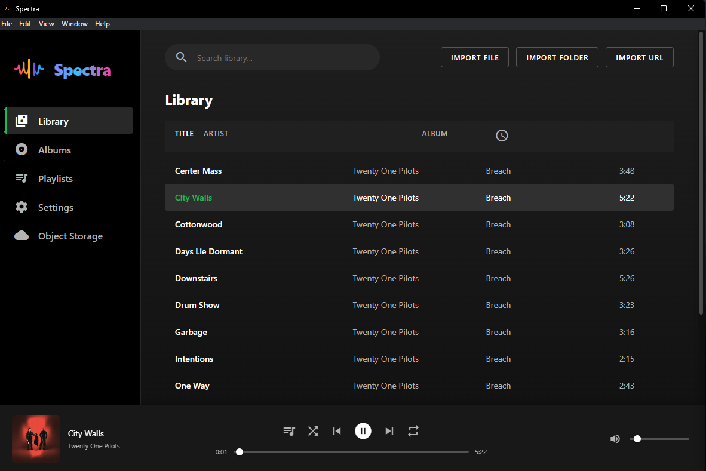

# **Spectra**

A high-quality desktop audio player built with **Electron**, featuring native exclusive audio output, metadata extraction, playlists, plugins, and an optional remote web client.



Download binaries, installers and extras at: https://spectra.f4ust.com — download for free.

Prebuilt binaries and installers are also published on the project's GitHub Releases page — GitHub-hosted binaries are free community builds.

---

## **✨ Features**

* ⚡ **Modern Electron UI** with album-scoped search & smooth transitions
* 🎵 **FFmpeg decoding pipeline** with support for high-resolution formats
* 🔊 **Native exclusive/shared audio output**

  * WASAPI (Windows)
  * CoreAudio (macOS)
  * ALSA (Linux)
* 🗂️ **SQLite music library** (tracks, playlists, metadata, covers)
* 🧩 **Plugin system** (`plugins/`) with Discord Presence, Object Storage & Last.fm examples
* 🌐 **Remote control mode** (Express + Socket.IO) with full UI over LAN
* 📦 **Electron Builder packaging** for Windows, macOS, and Linux

---


---

# **📥 Installing Spectra (Source Build Guide)**

You can clone and build Spectra directly from this official GitHub repository:

### **1. Clone the repository**

```powershell
git clone https://github.com/babymonie/spectra.git
cd spectra
```

Or using SSH:

```bash
git clone git@github.com:babymonie/spectra.git
cd spectra
```

---

### **2. Install dependencies**

```powershell
npm install
```

If you see native build errors, ensure:

* Visual Studio Build Tools (Windows)
* Xcode CLI Tools (macOS)
* build-essential + libasound2-dev (Linux)

---

### **3. Rebuild the native audio addon for Electron**

> Spectra uses a **C++ Node-API addon** (`exclusive_audio.node`).
> It *must* match your local Electron version.

Run:

```powershell
npm run rebuild-electron
```

This wraps `electron-rebuild` and fixes most ABI mismatches automatically.

---

### **4. Start Spectra (development mode)**

```powershell
npm start
```

This launches the Electron app using your local source tree.

---

# **🔄 Updating Spectra (Git Pull Guide)**

Whenever you want the latest features and bug fixes:

### **1. Save or stash your local changes**

If you changed files locally, do:

```powershell
git stash
```

or commit your edits:

```powershell
git add .
git commit -m "local changes"
```

---

### **2. Pull the newest changes**

```powershell
git pull
```

If you previously used `stash`:

```powershell
git stash pop
```

---

### **3. Rebuild native modules again**

Any update from GitHub may change Electron or the addon.

```powershell
npm run rebuild-electron
```

---

### **4. Launch again**

```powershell
npm start
```

---

# **🧹 Fixing Common Git Update Errors**

### **❗ “Your local changes would be overwritten by merge”**

Either commit or stash:

```powershell
git stash
git pull
git stash pop
```

---

### **❗ Module compiled against wrong NODE_MODULE_VERSION**

Run rebuild:

```powershell
npm run rebuild-electron
```

---

### **❗ Better-SQLite3 or audio addon failing to load**

Delete build artifacts → reinstall:

```powershell
rmdir /s /q node_modules
npm install
npm run rebuild-electron
```

---

# **🌐 Where Spectra Stores Your Library**

| OS          | Path                                     |
| ----------- | ---------------------------------------- |
| **Windows** | `%APPDATA%/Spectra/`                     |
| **macOS**   | `~/Library/Application Support/Spectra/` |
| **Linux**   | `~/.config/Spectra/`                     |

Your database, covers, plugin configs, and settings stay intact between updates.

--- 
### If you get errors:

* Ensure **Visual Studio Build Tools** are installed
* Enable "Desktop development with C++"
* Restart PowerShell after installation

---

## **🛠️ Build the Native Audio Addon**

The exclusive audio engine is a Node-API addon.

| Item              | Path                                 |
| ----------------- | ------------------------------------ |
| **Source**        | `src/exclusive_audio.cc`             |
| **Build config**  | `binding.gyp`                        |
| **Helper script** | `scripts/build.ps1`                  |
| **Output**        | `build/Release/exclusive_audio.node` |

### **Requirements per platform**

#### **Windows**

* Visual Studio Build Tools
* Windows 10 SDK
* Python 3.x

#### **macOS**

* Xcode Command Line Tools

#### **Linux**

```bash
sudo apt install build-essential libasound2-dev
```

### **Manual build**

```powershell
npx electron-rebuild   # recommended
# or
npx node-gyp rebuild
```

---


## **🔌 Plugins & Remote Control**

### Plugins (in `plugins/`)

Includes:

* **Discord Presence**
* **Object Storage uploader**
* **Last.fm scrobbler**
* Custom plugins can add:

  * Menus
  * UI overlays
  * Playback hooks
  * Library modifications

### Remote Mode

* Server: `remoteServer.js`
* Tech: **Express + Socket.IO**
* Serves:

  * HTML UI
  * Real-time playback state
  * Invoke API for remote commands

## Plugins & Remote
- See `plugins/README.md` for details (Discord Presence, Object Storage, Last.fm).
- Plugin API docs: `plugins/API_DOCS.md` — describes `manifest.json`, `plugin.js` lifecycle, `context.invoke` channels, events and examples.
- Remote server: `remoteServer.js` (Express + Socket.IO) serves UI and provides invoke API.

Plugin setup (quick steps)

1. Copy the plugin folder into the repository `plugins/` directory (e.g. `plugins/my-plugin`).
2. If the plugin has a `package.json`, install its dependencies:

```powershell
cd plugins\my-plugin
npm install
```

3. Restart Spectra (or reload plugins from the app settings) and enable the plugin in Settings → Plugins.

Notes:
- Plugins should include a valid `manifest.json` and export `activate(context)` from `plugin.js`.
- Use `plugins/API_DOCS.md` for recommended `context` usage and example code.
Launches automatically when user enables it in settings.

---

## **💎 Paid Features (coming next year)**

The core Spectra player and most features are available for free. Planned paid additions targeted for next year include:

- Full ASIO driver support (Windows)
- Dedicated ASIO driver plugin
- CD ripping plugin (FLAC, WAV, MP3 pipelines + metadata lookup)
- Mobile Remote App (Wi‑Fi control of the player)
- Themes system (dark/light/color themes, paid-only unlocks)
- Last.fm plugin integration (pending)
- Improved album organization and metadata correction tools

---

## **🧰 Troubleshooting**

### **Native addon won't load**

* Check console for `exclusiveLoadError`
* ABI mismatch → run:

```powershell
npm run rebuild-electron
```

### **No audio output**

* Another app may already hold the audio device exclusively
* Disable exclusive mode or choose shared output in settings

### **Covers/DB missing**

Spectra stores data in:

```
%APPDATA%/Spectra/
~/Library/Application Support/Spectra/
~/.config/Spectra/
```

---

### macOS: Gatekeeper / Unsigned app (temporary workaround)

If macOS prevents Spectra from opening with messages like "App is damaged" or "can't be opened because it is from an unidentified developer", try one of these local workarounds for development/testing:

- Finder: Right-click (or Control-click) the `.app` bundle → **Open** → confirm **Open** in the dialog. This bypasses Gatekeeper for that app once.

- Terminal (clear the quarantine attribute):

```bash
sudo xattr -cr /path/to/Spectra.app
```

or (explicitly remove the quarantine attribute):

```bash
sudo xattr -rd com.apple.quarantine /path/to/Spectra.app
```

Replace `/path/to/Spectra.app` with the actual path (for example `~/Downloads/Spectra-darwin-x64/Spectra.app` or `/Applications/Spectra.app`). These commands are useful for locally-built or downloaded unsigned apps used for testing.

Important: these are workarounds for local testing only. The recommended long-term solution for distributing macOS apps is to sign and notarize builds with an Apple Developer ID (Apple Developer Program membership required, currently an annual fee).

If you'd like, I can add CI-ready instructions for signing and notarization (macOS runner + secrets) or a short checklist for producing a signed release.


## **🛠️ Developer: Git hooks & version bump**

A lightweight post-commit version bump flow is included in the repository to keep the `package.json` patch version moving after each commit.

- Tracked files:
  - `.githooks/post-commit` — wrapper hook that runs the bump script if `core.hooksPath` is configured to `.githooks`.
  - `scripts/post-commit-bump.js` — Node script that increments the patch version in `package.json` and commits the change with the message `chore: bump version to X.Y.Z`.

How it works (local developer):

1. Enable the tracked hooks directory so Git runs the tracked hook automatically for your clone:

```powershell
git config core.hooksPath .githooks
```

2. After that, each `git commit` will trigger the hook which runs the bump script. The script will:

  - Skip creating a bump commit if the most recent commit message already looks like `chore: bump version to ...` (prevents an infinite loop).
  - Read `package.json`, increment the patch number (e.g. `1.2.3` → `1.2.4`), write the file, stage and commit it.

3. If you prefer to run the bump manually (for CI runs or manual control):

```powershell
npm run bump-version
```

Notes & options:

- If you don't want the hook to run locally, undo step (1) to restore the default local hooks directory:

```powershell
git config --unset core.hooksPath
```

- For teams that prefer server-side versioning or CI-based bumps, I can add a GitHub Action that runs the bump when changes are merged to `main` instead of using local hooks.

---

## **📄 License**

This project is licensed. See the `LICENSE` file for details.

